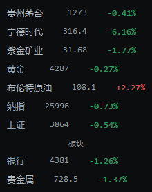

<h1 align="center">A股盯盘小窗</h1>
<p align="center"><b>A-Share Floating Quote</b></p>
<p align="center">Windows 10/11 · Python + Tkinter · 免费公开行情源</p>

> 一个轻量桌面悬浮盯盘小工具，支持股票、ETF 和板块盯盘，并内置黄金、布伦特原油、纳指、上证指数等指标。
>
> A lightweight always-on-top floating quote window for stocks, ETFs and sectors, with built-in indicators for gold, Brent crude, Nasdaq and the Shanghai Composite.

> 关键词：盯盘、悬浮窗、股票、ETF、板块、实时行情 / Keywords: stock quotes, floating window, always on top, ETF, sector, market data, Tkinter, a-share

[简体中文](#界面预览) | [English](#english)

## 界面预览



## 功能

- 标的和板块默认显示 3 个输入行，可以在设置里继续添加
- 显示名称、当前价和涨跌幅；名称和价格都可以单独隐藏
- 窗口可右键拖动，支持透明度、等比缩放和刷新间隔设置
- 内置黄金、布伦特原油、纳指、上证指数，可以在设置里显示或关闭
- 点击价格弹出日K小窗，点击涨跌幅弹出分时小窗，小窗跟随主窗口移动
- 设置、缩放、透明度窗口贴近悬浮窗弹出，并根据内容自动调整大小
- 多屏切换、远程桌面或 Win11 缩放后窗口跑偏时，可用「回到屏幕内」拉回

## 运行

```powershell
python app.py
```

也可以双击 `run.bat`。

## 使用

- 右键单击窗口：打开菜单
- 右键按住拖动：移动窗口
- 点击名称：隐藏或显示名称
- 右键菜单「设置」：设置标的代码/名称、板块代码/名称、名称隐藏、价格隐藏和刷新间隔
- 右键菜单「设置」：可以继续添加标的或板块，空行不会保存
- 右键菜单「设置」：可以开关黄金、布伦特原油、纳指、上证指数
- 右键菜单「透明度」：调节悬浮窗透明度
- 右键菜单「缩放」：等比例调节悬浮窗大小
- 右键菜单「回到屏幕内」：窗口跑到屏幕外时拉回当前可见屏幕

窗口启动、移动和退出时都会自动检查位置，避免保存到屏幕外导致下次打开看不到。

## 标的和板块写法

股票和 ETF 支持这些写法：

```
600519      sh600519      000001      sz000001
紫金矿业     铜陵有色
510300      sh510300      159915      sz159915
沪深300ETF华泰柏瑞          创业板ETF易方达
```

板块支持这些写法：

```
BK0475      0475      银行      贵金属
```

## 数据来源说明

当前版本使用免费的公开行情源获取股票、ETF、黄金、布伦特原油、纳指、上证指数和板块数据，只适合个人小频率盯盘。布伦特原油使用东方财富 `B00Y` 当月连续口径。

免费公开源可能出现限流、接口变化或短时不可用；如果以后失效，只需要替换 `stock_floater/market_data.py` 里的行情 provider。

- 个股和板块的涨跌幅使用行情源返回的最新涨跌幅：盘中显示实时涨跌幅，盘后和盘前显示最近一个交易日的收盘涨幅
- 板块行情会分页拉取东方财富行业和概念板块，支持 `BK0800` 这类不在第一页的板块代码
- 某一次免费接口短暂失败时，界面会保留上一轮有效行情，避免临时显示成 `--`
- 刷新时只有显示内容发生变化才重绘界面，减少悬浮窗闪烁；股票、板块和市场指标并行请求，避免互相拖慢
- 交易活跃时段按设置的刷新间隔刷新，最低 1 秒；非活跃时段自动降到至少 30 秒，减少无意义请求

## 项目结构

```
app.py                      启动入口
stock_floater/
  ui.py                     悬浮窗界面、菜单、设置窗口
  market_data.py            行情抓取（股票 / 板块 / 市场指标）
  chart_data.py             分时与日K数据
  chart_popup.py            点击价格或涨跌幅弹出的图表小窗
  quote_cache.py            行情缓存
  config.py                 设置读写
  windowing.py              窗口位置与多屏处理
```

## 免责声明

行情来自公开数据源，仅供个人盯盘参考，不构成任何投资建议。

---

## English

**A-share Floating Quote Window** is a small always-on-top desktop panel that keeps a few stocks, ETFs and sectors in view while you work somewhere else.

### Features

- Three configurable rows by default (stocks, ETFs or sectors); add more in Settings
- Name, price and change percentage per row, with name/price individually hideable
- Right-click to open the menu, hold the right button to drag the window
- Adjustable opacity, proportional scaling and refresh interval
- Built-in gold, Brent crude, Nasdaq and Shanghai Composite indicators (toggleable)
- Click a price to open a daily K-line popup, click a change percentage for an intraday chart
- "Back on screen" command brings the window back when display layouts change

### Run

```powershell
python app.py
```

or double-click `run.bat`.

### Data source

Quotes come from free public endpoints (East Money / Sina style), so the tool suits light personal use. Brent crude uses East Money `B00Y` front-month continuous. If an endpoint changes, only the provider inside `stock_floater/market_data.py` needs replacing. During quiet market hours the refresh interval automatically relaxes to at least 30 seconds.

This project is for personal monitoring only and is not investment advice.
